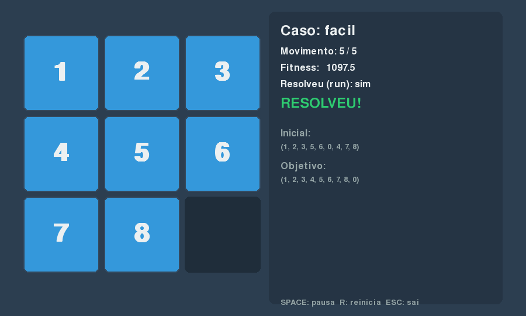
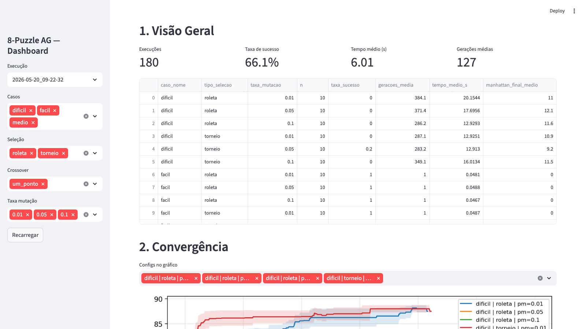
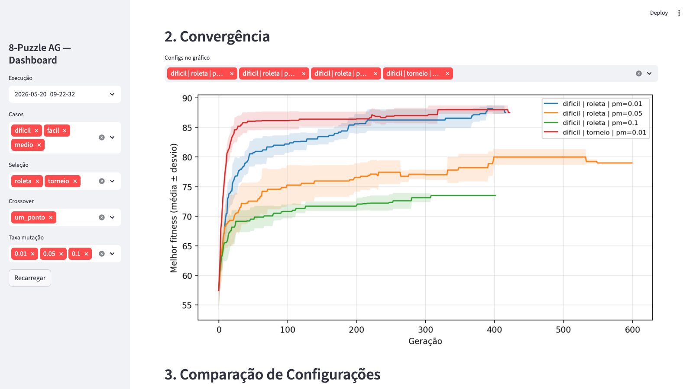
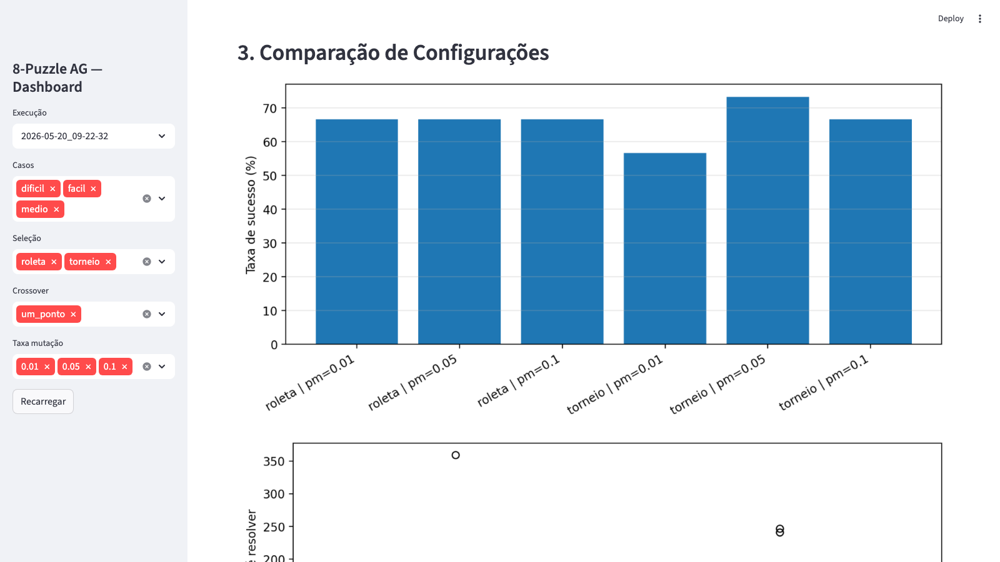
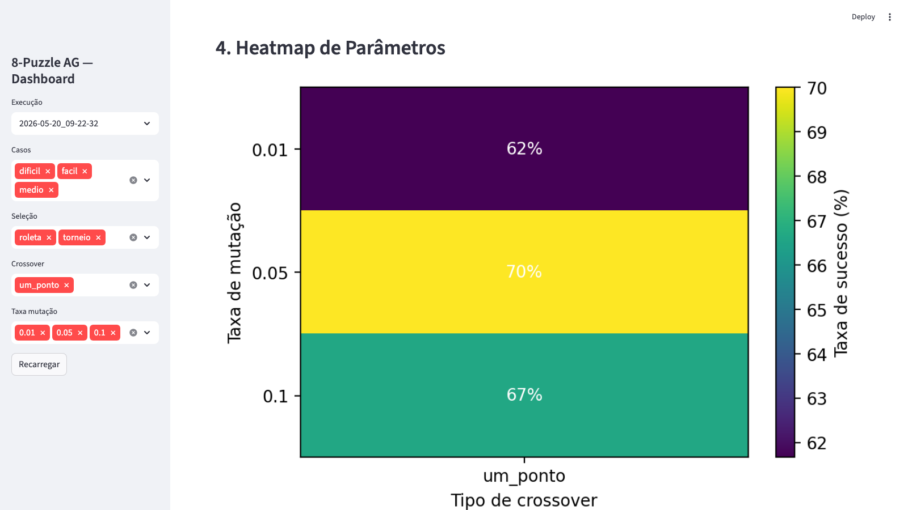
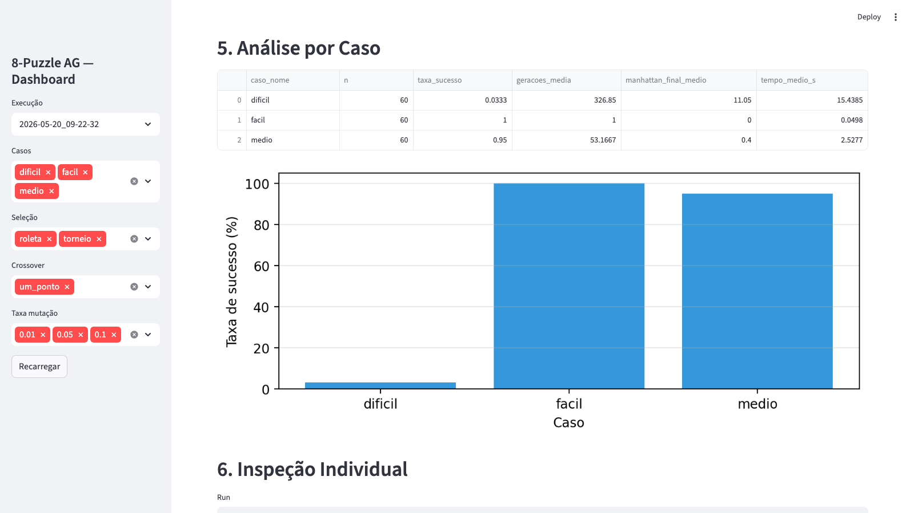
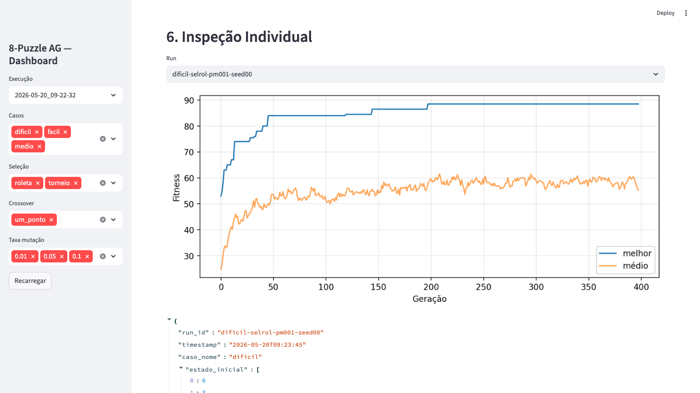

# 8-Puzzle com Algoritmo Genético

Resolução do 8-puzzle usando um Algoritmo Genético implementado **na munheca**
(sem bibliotecas de GA). Trabalho de Inteligência Artificial.

> Estado atual: **Fases 1–5 concluídas**. Domínio do puzzle, motor do AG,
> experimentação batch e camada de visualização (Pygame + Streamlit) prontos.
> O `roadmap-8puzzle-ag.md` é a fonte da verdade do projeto.

## Requisitos

- Python 3.11+ (desenvolvido e testado em 3.14)
- Dependências em `requirements.txt`

## Instalação

```bash
python3 -m venv .venv
source .venv/bin/activate            # Windows: .venv\Scripts\activate
pip install -r requirements.txt
```

> Nota: usamos `pygame-ce` (community edition), drop-in replacement do `pygame`
> com wheels pré-compiladas para Python 3.13/3.14. O `import pygame` continua
> idêntico no código.

## Como rodar

Todos os comandos passam pelo `main.py`:

```bash
# Rodar o batch completo de experimentos (salva em results/<timestamp>/)
python main.py run

# Animar a melhor execução da pasta mais recente
python main.py animate --latest

# Animar uma execução específica
python main.py animate results/2026-05-20_09-22-32/detalhes/facil-seltor-pm005-seed00.json

# Ajustar a velocidade da animação (ms entre movimentos, default 300)
python main.py animate --latest --delay 500

# Subir o dashboard interativo
python main.py dashboard

# Rodar os testes
python main.py test
```

## Controles do Pygame

- **SPACE** — pausa/continua
- **R** — reinicia do estado inicial
- **ESC** — sai

## Estrutura do projeto

```
t2-ag-puzzle/
├── puzzle/             # Domínio do 8-puzzle (Fase 1)
│   ├── estado.py
│   ├── movimentos.py
│   ├── goal.py
│   └── heuristicas.py
├── ga/                 # Motor do Algoritmo Genético (Fase 2)
│   ├── cromossomo.py
│   ├── populacao.py
│   ├── selecao.py
│   ├── crossover.py
│   ├── mutacao.py
│   ├── elitismo.py
│   └── engine.py
├── experiment/         # Runner, batch, métricas, persistência (Fase 3)
├── viz/                # Pygame + Streamlit (Fase 5)
│   ├── _io.py          # Helpers puros (parsing, descoberta de pastas)
│   ├── pygame_anim.py  # Animação Pygame
│   └── dashboard.py    # Dashboard Streamlit
├── tools/              # Scripts auxiliares (geração de screenshots, etc.)
├── tests/              # Testes unitários (93 testes verdes)
├── docs/screenshots/   # Capturas para o relatório
├── config.py           # GAConfig dataclass
├── fitness.py          # Bridge puzzle ↔ AG
├── main.py             # CLI principal
├── conftest.py
├── pytest.ini
└── requirements.txt
```

## O domínio do puzzle

O estado é uma `tuple[int, ...]` de 9 elementos, com `0` representando o espaço
vazio. O estado objetivo é `(1, 2, 3, 4, 5, 6, 7, 8, 0)`. Cada direção move o
**espaço vazio** naquele sentido (a peça vizinha ocupa o lugar do vazio).

Apenas metade das permutações do 8-puzzle é solucionável; use
`puzzle.heuristicas.eh_soluvel` antes de tentar resolver um estado.

## Capturas de tela

### Pygame — Animação do puzzle resolvendo



Tabuleiro 3×3 monocromático sóbrio (paleta `#2c3e50` / `#3498db`), painel
lateral com caso, contador de movimentos, fitness, estado inicial/objetivo e
indicação verde de "RESOLVEU!" ao alcançar o goal.

### Dashboard Streamlit — 6 seções analíticas

| Seção | Captura |
|---|---|
| 1. Visão Geral (KPIs + tabela agregada) |  |
| 2. Convergência (média ± desvio por config) |  |
| 3. Comparação (taxa de sucesso + boxplot) |  |
| 4. Heatmap (mutação × crossover → sucesso) |  |
| 5. Análise por Caso |  |
| 6. Inspeção Individual de uma run |  |

A sidebar global permite filtrar por **pasta de execução**, **casos**,
**tipo de seleção**, **tipo de crossover** e **taxa de mutação**. Todos os
gráficos respondem ao filtro.

## Testes

```bash
python main.py test
```

93 testes cobrindo: puzzle (movimentos, validade, solvabilidade,
heurísticas), GA (operadores, engine, elitismo), fitness composto,
experimentos (runner, batch, métricas, persistência) e viz IO
(parsing, descoberta de pastas, seleção do melhor run).
