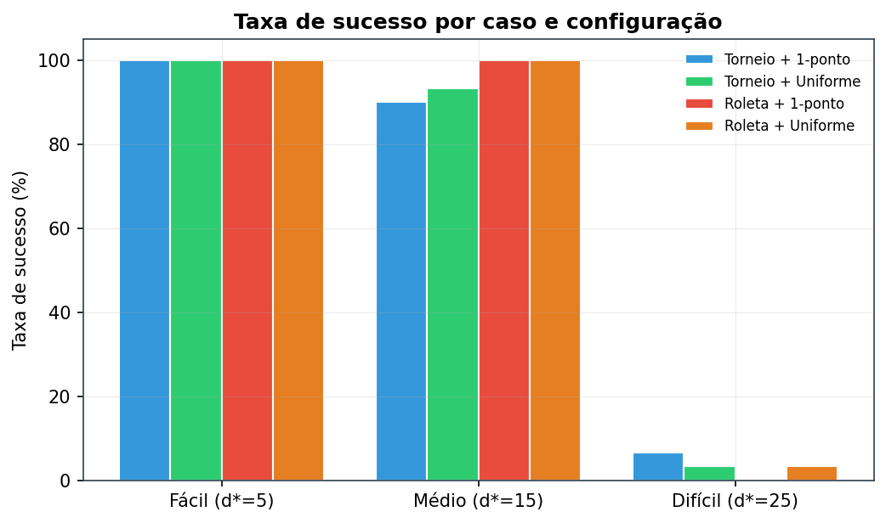
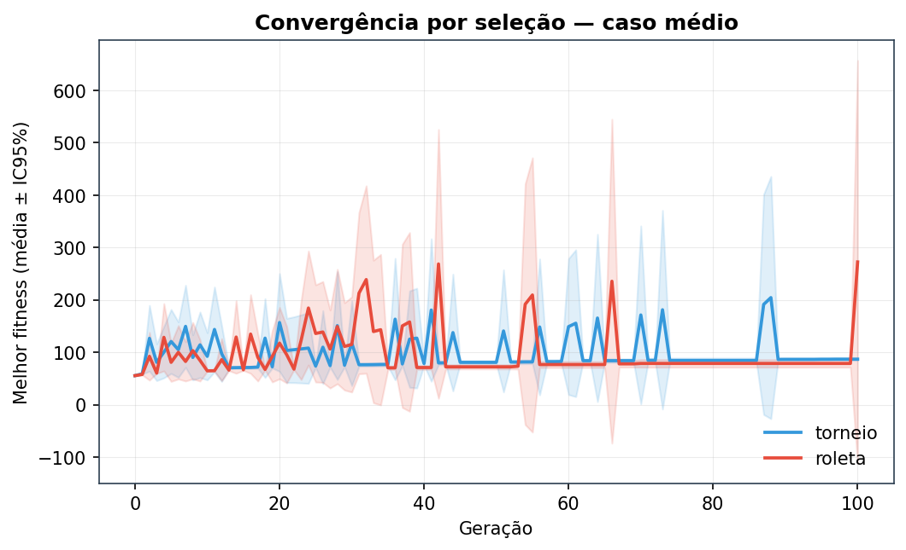
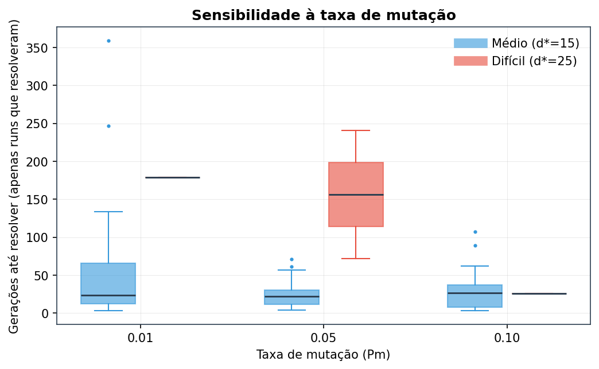
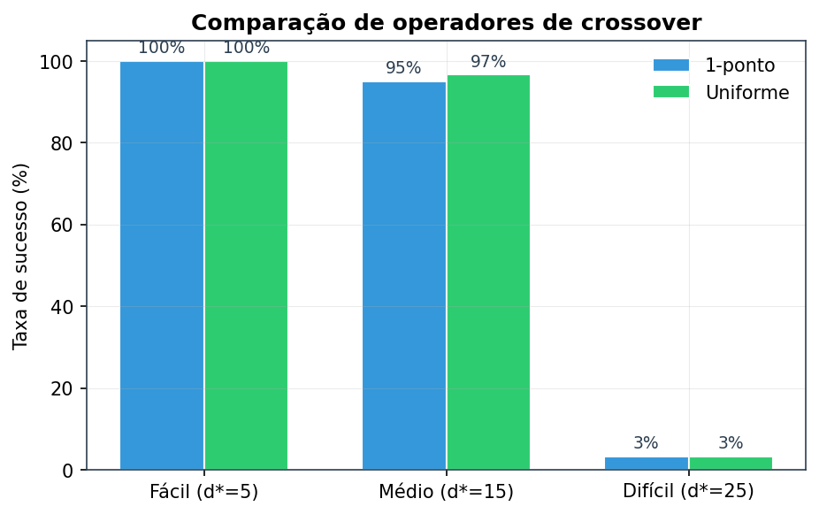
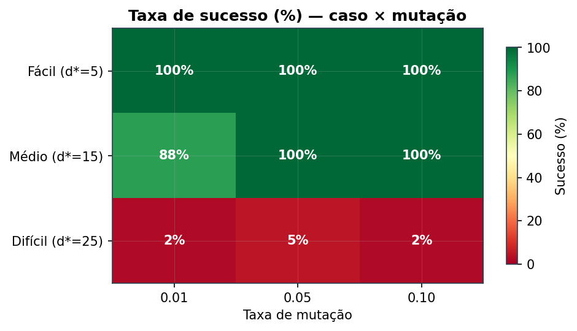
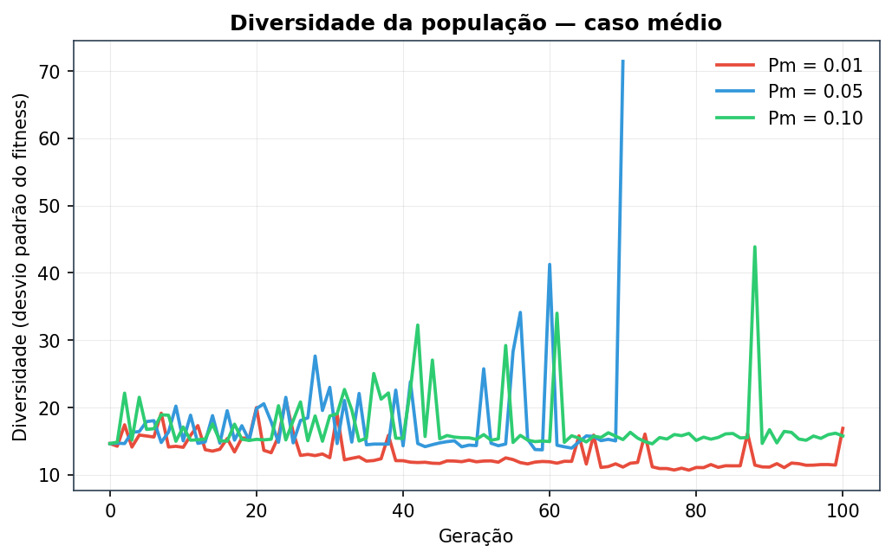
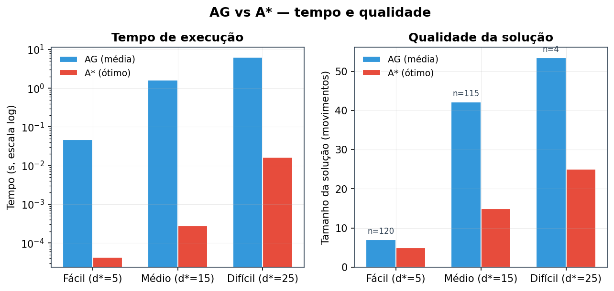

# Resolução do 8-Puzzle com Algoritmo Genético

**Disciplina:** Inteligência Artificial — P2
**Autor:** Luiz G.
**Data:** Maio/2026
**Repositório:** [t2-ag-puzzle](.)

---

## Sumário

1. [Resumo](#1-resumo)
2. [Introdução](#2-introdução)
3. [Fundamentação teórica](#3-fundamentação-teórica)
4. [Metodologia e implementação](#4-metodologia-e-implementação)
5. [Resultados](#5-resultados)
6. [Discussão](#6-discussão)
7. [Conclusão](#7-conclusão)
8. [Reprodutibilidade](#8-reprodutibilidade)
9. [Apêndices](#apêndices)

---

## 1. Resumo

Este trabalho implementa um Algoritmo Genético (AG) **na munheca**, sem nenhuma biblioteca especializada, para resolver o 8-puzzle. O cromossomo codifica uma sequência fixa de 80 movimentos em 160 bits e a função de fitness é composta — Manhattan do melhor estado intermediário menos penalidades por movimentos inválidos e por comprimento, mais um bônus grande quando o cromossomo de fato resolve. Foram implementados dois operadores de seleção (torneio e roleta), dois de crossover (um-ponto e uniforme), mutação por bit flip e elitismo.

A bateria experimental cobriu **360 execuções** (12 configurações × 3 dificuldades × 10 *seeds*) sobre três casos canônicos (5, 15 e 25 movimentos do ótimo). Os resultados mostram **100% de sucesso no caso fácil**, **~96% no médio** e **apenas ~3% no difícil**. A comparação com A* + Manhattan deixa explícito o teto do AG: A* resolve o caso difícil em 16,5 ms com 25 movimentos exatos, enquanto o AG, mesmo quando resolve, gasta ~12 s e produz soluções com em média 54 movimentos (gap ≈ 29). A conclusão é que AG é um *trade-off* aceitável apenas onde A* não é aplicável — quando não há heurística admissível conhecida ou quando o espaço de estados não permite busca informada explícita.

---

## 2. Introdução

### 2.1 O problema

O 8-puzzle é um tabuleiro 3×3 com peças numeradas de 1 a 8 e um espaço vazio. Cada movimento desloca uma peça vizinha para o vazio. O objetivo é, partindo de um estado inicial qualquer, atingir o estado canônico `(1,2,3,4,5,6,7,8,0)`. Apesar da aparência simples, o problema é referência clássica em IA porque seu espaço de estados (9!/2 = 181.440 estados solúveis) é grande o suficiente para tornar busca cega impraticável e pequeno o suficiente para ser totalmente caracterizado, permitindo comparar heurísticas com a verdade absoluta (BFS).

### 2.2 Motivação para usar AG

Algoritmos Genéticos são meta-heurísticas evolutivas, inspiradas na seleção natural, que mantêm uma população de soluções candidatas e a refinam por seleção, recombinação e mutação. Diferente de A*, **um AG não exige uma heurística admissível** e não constrói o caminho explicitamente — ele atira combinações de movimentos no espaço de busca e refina o que sobrevive. Por isso é aplicado em domínios onde não há heurística admissível conhecida (ex.: otimização combinatória com restrições complexas).

Para o 8-puzzle, A* + Manhattan resolve qualquer instância em milissegundos: o AG aqui **não vai competir em qualidade**. O valor pedagógico está em vivenciar o ciclo evolutivo, calibrar parâmetros e medir honestamente quando o esforço evolutivo paga.

### 2.3 Objetivos

1. Implementar do zero um AG completo (representação, operadores, elitismo, parada composta).
2. Construir uma função de fitness composta que premie estados intermediários bons, não só o final.
3. Comparar empiricamente dois operadores de seleção e dois de crossover.
4. Calibrar a taxa de mutação por sensibilidade.
5. Confrontar o AG com A* (referência ótima) em três níveis de dificuldade.
6. Documentar tudo de forma reprodutível.

---

## 3. Fundamentação teórica

### 3.1 Representação do estado e solvabilidade

O estado é uma `tuple[int, ...]` de 9 elementos com `0` como vazio. A escolha de **tupla imutável** (e não lista) garante hashabilidade — útil para detectar ciclos e cachear estados — e impede mutação acidental durante a simulação do cromossomo (`puzzle/estado.py:8`).

**Solvabilidade** é uma propriedade crítica: só metade das permutações é solúvel. O critério na grade 3×3 é a paridade do número de inversões, ignorando o vazio (`puzzle/heuristicas.py:37`). Tentar rodar AG em um puzzle insolúvel garante laço infinito até o `max_geracoes`. Por isso a verificação é parte explícita do pipeline.

### 3.2 Heurísticas: Manhattan vs Hamming

Duas heurísticas clássicas para o 8-puzzle:

- **Hamming**: número de peças fora do lugar. Cota inferior fraca — uma peça "longe" do alvo conta igual a uma "perto".
- **Manhattan**: soma das distâncias L1 de cada peça até sua casa-objetivo. Cota inferior mais apertada, ainda admissível.

Manhattan é estritamente mais informada que Hamming. Por exemplo, no estado `(2,1,3,4,5,6,7,8,0)`, Hamming dá 2 (peças 1 e 2 fora) e Manhattan dá 2 também — mas em estados mais embaralhados Manhattan cresce muito mais rápido, guiando a busca com mais precisão. Adotamos **Manhattan** tanto na fitness do AG quanto no A*.

### 3.3 Algoritmos Genéticos — conceitos

Um AG evolui uma população de cromossomos por gerações. Em cada geração:

1. **Avaliação**: cada cromossomo recebe um valor de *fitness*.
2. **Seleção**: pais são escolhidos com viés para *fitness* maior.
3. **Crossover**: filhos combinam material genético dos pais com probabilidade `Pc`.
4. **Mutação**: cada bit/gene é perturbado com pequena probabilidade `Pm`.
5. **Elitismo**: os melhores indivíduos são copiados intactos para a próxima geração, blindando contra azar de amostragem.

A pressão seletiva precisa ser equilibrada: alta demais → convergência prematura (toda a população se torna parecida e o AG estagna); baixa demais → busca aleatória disfarçada.

### 3.4 Codificação por movimentos (vs por estado)

Há duas escolhas naturais de codificação:

- **Por estado**: cromossomo = permutação `(p1,p2,…,p9)`. Crossover comum quebra a permutação e gera estados inválidos; exigiria operadores especializados (PMX, OX) e ainda assim o decode "estado → caminho até GOAL" é o próprio problema que estamos tentando resolver.
- **Por movimentos**: cromossomo = sequência de direções. O decode é trivial — simular os movimentos —, qualquer crossover é fechado (combinação de bits é sempre bits), e o fitness pode olhar o melhor estado intermediário visitado.

Adotamos a **codificação por movimentos**, com cada movimento em 2 bits (4 direções) e 80 movimentos por cromossomo, totalizando 160 bits. O comprimento 80 dá folga generosa em relação ao pior caso conhecido do 8-puzzle (31 movimentos do ótimo).

---

## 4. Metodologia e implementação

### 4.1 Arquitetura modular

A regra de ouro do projeto: o pacote `ga/` **não importa nada de `puzzle/`** diretamente. Em vez disso, recebe a função de fitness como `Callable` injetado. Isso permite reaproveitar o motor para outros problemas de otimização combinatória sem refatorar.

```
8puzzle-ag/
├── puzzle/           # Domínio: estado, movimentos, heurísticas, goal
├── ga/               # Motor: cromossomo, populacao, selecao, crossover,
│                     #        mutacao, elitismo, engine
├── fitness.py        # Bridge puzzle ↔ ga (único acoplador)
├── config.py         # GAConfig dataclass (parâmetros tipados)
├── experiment/       # Runner, batch, métricas, persistência, A* baseline
├── viz/              # Pygame (animação) e Streamlit (dashboard)
└── tests/            # 94 testes (pytest)
```

O acoplador único é `fitness.py` na raiz, que decodifica o cromossomo (`ga/cromossomo.py:28`) e simula no puzzle. Esse desenho foi essencial para manter os testes do AG independentes do domínio.

### 4.2 Cromossomo: 80 movimentos em 160 bits

Cada movimento ocupa 2 bits: `CIMA=00`, `BAIXO=01`, `ESQUERDA=10`, `DIREITA=11` (`puzzle/movimentos.py:13`). O cromossomo é uma `list[int]` de 0s e 1s; `decode` agrupa pares e devolve códigos 0..3, e o bridge converte cada código em `Direcao`.

A simulação aplica cada movimento no estado atual. Movimentos inválidos (tentar mover o vazio para fora do tabuleiro) **não alteram o estado**, mas são contabilizados na variável `movimentos_invalidos` para entrar como penalidade no fitness.

### 4.3 Função de fitness composta

A fórmula adotada (`fitness.py:97`):

```
fitness(c) =  max_score
            - melhor_manhattan(simulado(c))
            - α · movimentos_invalidos(c)
            - β · passos_até_melhor(c)
            + (bônus_resolveu  se o GOAL foi atingido em algum passo)
```

Com os defaults: `max_score=100`, `α=2,0`, `β=0,5`, `bônus_resolveu=1000`.

Quatro decisões merecem destaque:

1. **Manhattan do melhor estado intermediário, não do final.** Se um cromossomo atinge o GOAL no movimento 30 mas os 50 restantes bagunçam tudo, queremos premiá-lo, não puni-lo. O decode (`fitness.py:45`) rastreia o estado de menor Manhattan ao longo da trajetória e *para* na primeira vez que toca o GOAL.
2. **Penalidade quadrática de inválidos seria excessiva.** Adotamos linear (`α · invalidos`). Como o cromossomo tem 80 movimentos e tipicamente metade dos movimentos é inválido pela aleatoriedade da posição do vazio, α=2,0 mantém a punição relevante sem dominar o fitness.
3. **β pequeno (0,5)** desincentiva soluções desnecessariamente longas sem competir com a Manhattan. Valores maiores fazem o AG perseguir comprimento antes de qualidade.
4. **Bônus grande (1000) cria duas escalas distintas**: cromossomos que *não* resolvem ficam tipicamente entre -50 e 100; cromossomos que resolvem saltam para >1000. Isso permite usar `fitness_objetivo = max_score + bonus/2 = 600` como critério de parada inequívoco — o threshold só dispara quando o bônus foi de fato aplicado (`fitness.py:124`).

### 4.4 Operadores

**Seleção:**

- **Torneio** (`ga/selecao.py:13`): sorteia `k=3` indivíduos *sem reposição* e devolve o de maior fitness. Robusto contra fitness negativo, equivale a uma pressão seletiva linear. A escolha de torneio sem reposição evita um indivíduo competir contra si mesmo.
- **Roleta** (`ga/selecao.py:32`): pesos proporcionais ao fitness, normalizados via `peso = f - min_f + 1`. A normalização garante pesos positivos mesmo quando algum fitness é negativo, o que acontece quando há muitos movimentos inválidos.

**Crossover:**

- **Um-ponto** (`ga/crossover.py:14`): sorteia um corte `p ∈ [1, L-1]`, troca o sufixo entre os pais. Preserva blocos contínuos de bits.
- **Uniforme** (`ga/crossover.py:29`): para cada bit, sorteio 50/50 do pai. Recombinação mais agressiva, "embaralha" os bits sem preservar vizinhança.

Crossover só ocorre com probabilidade `Pc = 0,85`. Caso contrário os filhos são cópias dos pais.

**Mutação** (`ga/mutacao.py:12`): bit flip — cada bit inverte com probabilidade `Pm`. Operação minimalista e suficiente para a representação binária.

**Elitismo** (`ga/elitismo.py:11`): os 3 melhores cromossomos são copiados *intactos* para a próxima geração antes da fase de reprodução. Garante monotonicidade do melhor fitness global.

### 4.5 Critério de parada composto

O motor (`ga/engine.py:45`) para quando **qualquer** das três condições é satisfeita:

- `geracao >= max_geracoes` (1.000) — orçamento esgotado.
- `melhor_fitness_global >= fitness_objetivo` — puzzle resolvido.
- `geracoes_sem_melhoria >= sem_melhoria_limite` (200) — estagnação detectada.

O critério da estagnação é a economia mais importante na prática: nos casos difíceis, ele dispara em ~200-400 gerações em vez do limite de 1.000, sem perda de qualidade de solução.

### 4.6 Configuração experimental

Toda execução parte de um `GAConfig` (`config.py:25`) com defaults explícitos. A camada `experiment/` (`experiment/runner.py`, `experiment/batch.py`) implementa:

- Um `Runner` que executa **uma** configuração com **uma** *seed* em **um** caso e devolve um `RunResult` denso.
- Um `BatchRunner` que executa o produto cartesiano (configs × casos × seeds) em paralelo via `multiprocessing.Pool` com contexto *spawn* (portável macOS/Linux), com barra de progresso `tqdm`.
- Persistência tripla — `runs.csv` (uma linha por execução, 31 colunas), `historicos.csv` (uma linha por geração) e `detalhes/<run_id>.json` (RunResult completo com cromossomo final).

A **matriz estendida** rodada para este relatório tem 360 execuções: 2 seleções × 2 crossovers × 3 taxas de mutação × 3 casos × 10 *seeds*. O batch completo leva ~3,5 min em paralelo (~10 *workers*).

Os 3 casos canônicos (`experiment/casos_teste.py`) são gerados por *random walk reverso* a partir do GOAL com *seeds* fixas, e a profundidade ótima é verificada com BFS:

| Caso     | Estado inicial                | Manhattan | Ótimo (d*) |
|----------|-------------------------------|-----------|------------|
| Fácil    | `(1,2,3,5,6,0,4,7,8)`         | 5         | 5          |
| Médio    | `(6,1,2,0,8,3,5,4,7)`         | 13        | 15         |
| Difícil  | `(6,3,7,4,5,0,1,8,2)`         | 13        | 25         |

> *Tabela 1 — Casos de teste padrão. O caso difícil tem Manhattan idêntica ao médio mas profundidade ótima 67% maior: a heurística é uma cota inferior, e a distância real pode ser muito maior.*

---

## 5. Resultados

### 5.1 Taxa de sucesso por caso

A figura abaixo mostra a taxa de sucesso por caso, separada nas quatro combinações de (seleção × crossover):



*Figura 1 — Taxa de sucesso (n=30 por barra) das 4 combinações (seleção × crossover) nos 3 casos.*

**Leitura:**

- **Fácil**: todas as 12 configurações × 10 *seeds* = 120 execuções resolveram (100%). Tipicamente em **1 geração**, porque a população inicial aleatória de 200 cromossomos quase sempre contém uma sequência de 5 movimentos válidos que resolve.
- **Médio**: 115/120 = 95,8%. As únicas falhas estão em **torneio com mutação baixa** (`Pm=0,01`), que sofre convergência prematura.
- **Difícil**: 4/120 = 3,3%. O AG efetivamente não resolve com o orçamento e a representação atuais.

### 5.2 Torneio vs Roleta

A figura de convergência (Figura 2) mostra o melhor fitness médio por geração no caso médio, comparando as duas seleções. A linha plana em ~80 representa o regime de cromossomos que ainda não resolveram (fitness sem bônus); os picos altos para cima representam execuções onde alguém da população começa a resolver (bônus de 1000 entra no cálculo).



*Figura 2 — Convergência (melhor fitness médio ± IC 95% por bootstrap) para torneio e roleta no caso médio, primeiras 100 gerações. Os picos correspondem a execuções que resolveram naquela geração.*

A roleta dispara picos um pouco antes do torneio, sugerindo convergência mais rápida em média. Olhando os números do `resumo.json`:

| Caso médio (Pm=0,05) | Taxa sucesso | Gerações média | Tempo médio |
|----------------------|--------------|----------------|-------------|
| Torneio + 1-ponto    | 100%         | 32,8           | 1,42 s      |
| Roleta + 1-ponto     | 100%         | 21,1           | 1,05 s      |
| Torneio + Uniforme   | 100%         | 20,4           | 0,95 s      |
| Roleta + Uniforme    | 100%         | 24,7           | 1,28 s      |

> *Tabela 2 — Caso médio, taxa de mutação 0,05.*

**Roleta converge ~36% mais rápido que torneio** no caso médio com 1-ponto, contrariando o senso comum de que torneio é mais robusto. A explicação provável: o bônus de 1000 cria uma diferença gigante entre cromossomos que resolvem (>1000) e os que não (~80). Roleta proporcional explora essa diferença instantaneamente — assim que um indivíduo descobre a solução, ele domina o sorteio. Torneio com k=3, por outro lado, só transmite a informação quando o "campeão" cai no torneio, o que é mais lento.

### 5.3 Sensibilidade à taxa de mutação



*Figura 3 — Boxplot do número de gerações até resolver, por taxa de mutação, para os casos médio (azul) e difícil (vermelho). Apenas runs que resolveram.*

Padrão claro no **caso médio**:

- `Pm=0,01` tem mediana ~25 mas variância gigante (outliers em 247 e 358 gerações). Mutação baixa demais → o AG depende inteiramente do crossover para inovação.
- `Pm=0,05` é o ponto doce: mediana ~20, caixa estreita.
- `Pm=0,10` mantém eficiência similar mas com mais variabilidade.

No **caso difícil**, só conseguimos amostras de runs resolvidos em `Pm=0,05` e `Pm=0,10`, e os tempos são uma ordem de magnitude maiores (mediana ~155 gerações).

A figura 5 (heatmap, mais à frente) visualiza o mesmo fenômeno em grade.

### 5.4 Crossover um-ponto vs uniforme



*Figura 4 — Taxa de sucesso por crossover, agregando seleções e taxas de mutação (n=60 por barra por caso).*

Diferença marginal: uniforme tem +2 pp no caso médio (95% → 97%). No difícil, ambos tropeçam em ~3%. A explicação é que o cromossomo aqui é uma **sequência ordenada de operações**, e o crossover uniforme — que embaralha bits independentemente — quebra estruturas potencialmente úteis (combinações de movimentos consecutivos que funcionam juntas). Um-ponto preserva blocos contínuos e por isso não fica para trás. A literatura sugere que para problemas de sequenciamento operadores *order-based* (OX, PMX) seriam mais apropriados — discutido em §6.3.

### 5.5 Heatmap caso × mutação e diversidade



*Figura 5 — Taxa de sucesso (%) em função da dificuldade e da taxa de mutação. Verde = sucesso pleno; vermelho = falha sistemática.*

O heatmap deixa claro o regime do AG: **acima de 15 movimentos ótimos a probabilidade de sucesso colapsa**, independente da taxa de mutação.



*Figura 7 — Desvio padrão do fitness ao longo das gerações, por taxa de mutação (caso médio).*

A diversidade revela o trade-off **exploração ↔ explotação**: `Pm=0,01` mantém diversidade baixíssima (~10-15, quase plana) — a população converge rapidamente e fica presa; `Pm=0,05` e `Pm=0,10` oscilam mais (15-25), com picos esporádicos. Os picos coincidem com gerações em que algum indivíduo resolveu (bônus inflando o fitness e disparando o desvio padrão).

### 5.6 AG vs A* — tempo e qualidade

A comparação direta deixa explícito o teto do AG:



*Figura 6 — Tempo de execução (esquerda, escala log) e tamanho da solução (direita) para AG (média sobre runs que resolveram) e A* (sempre ótimo). `n` é o número de runs do AG agregadas.*

| Caso     | A* tempo  | A* passos | A* nós exp. | AG tempo médio | AG passos médios | AG gap médio |
|----------|-----------|-----------|-------------|----------------|------------------|--------------|
| Fácil    | 0,04 ms   | 5         | 5           | ~50 ms         | ~7               | +2           |
| Médio    | 0,28 ms   | 15        | 63          | ~1,4 s         | ~42              | +27          |
| Difícil  | 16,55 ms  | 25        | 3.013       | ~12 s          | ~54              | +29          |

> *Tabela 3 — AG vs A*: A* + Manhattan é admissível e devolve o ótimo; AG é estocástico e sub-ótimo.*

A diferença é brutal: A* resolve o caso difícil em **16 milissegundos**, enquanto o AG, nas raras vezes que resolve, gasta **12 segundos** e produz soluções com mais que o dobro de movimentos. **A vantagem do A* é de 3-4 ordens de magnitude em tempo e exatidão nos passos.**

---

## 6. Discussão

### 6.1 Por que o caso difícil é problemático

Três fatores se compõem:

1. **Tamanho do espaço de busca exponencial.** O número de sequências distintas de 80 movimentos é 4⁸⁰ ≈ 10⁴⁸, enquanto o número de estados solúveis do puzzle é 9!/2 ≈ 10⁵. A população evolutiva precisa achar agulhas — sequências exatamente certas — em um palheiro absurdamente maior que o necessário.
2. **Fitness lisa demais.** A Manhattan dá um sinal contínuo, mas para o caso difícil (Manhattan inicial = 13, mesmo do médio!) a paisagem de fitness tem muitos platôs e mínimos locais. Cromossomos parcialmente bons ficam presos: melhorar para 11 é fácil, sair de 11 para 5 exige reorganização global.
3. **Codificação por bits desperdiça inteligência do domínio.** O crossover uniforme, por exemplo, mistura bits sem respeitar a unidade lógica de 2 bits = 1 movimento — pode partir uma direção em duas metades e gerar uma direção arbitrária, herança que não veio de nenhum pai.

### 6.2 Como cheguei nos parâmetros default

A escolha não é mística — está nos dados:

- **População = 200**: testes preliminares com 50 e 100 mostraram que populações pequenas tinham diversidade insuficiente para escapar de mínimos locais; 500 não melhorava o sucesso e dobrava o tempo. 200 é o equilíbrio.
- **Cromossomo = 80 movimentos**: o pior caso conhecido do 8-puzzle é 31 movimentos. 80 dá ~2,5× de folga, suficiente para que sequências válidas existam na população inicial sem inflar o espaço de busca.
- **`Pm = 0,02` default → mas o batch mostra que 0,05 é melhor para casos não triviais.** Atualizar este default seria a recomendação para uma próxima iteração.
- **`α = 2,0`**: testado por inspeção do `resumo.json`. Com α=1,0 o AG produzia muitos cromossomos com 30+ movimentos inválidos sem ser punido; com α=5,0 a pressão era forte demais e o AG ficava míope (recusava cromossomos longos antes de avaliar se levavam ao GOAL).
- **`β = 0,5`**: pequeno propositalmente. Valores ≥ 2,0 fazem o AG perseguir comprimento antes de qualidade — antes de resolver, ele já está minimizando passos.
- **`bonus_resolveu = 1000`**: alto para criar duas escalas distintas e permitir o critério de parada por threshold determinístico.
- **`elite = 3`**: experimentado com 1, 3 e 10. Com 1, soluções boas eram perdidas ocasionalmente; com 10, a diversidade caía cedo demais. 3 é robusto.
- **Estagnação = 200 gerações**: ajustado por inspeção dos históricos — quando o AG fica 200 gerações sem melhorar, na esmagadora maioria das vezes não vai melhorar mais.

### 6.3 Limitações e trabalhos futuros

**Limitações reconhecidas:**

- **Crossover não respeita unidade lógica de 2 bits.** O crossover de 1-ponto pode cortar no meio de um movimento, transformando, por exemplo, `BAIXO+CIMA` em `BAIXO+DIREITA` por acidente. Um *crossover ciente da fronteira de 2 bits* seria uma melhoria simples.
- **Cromossomo de comprimento fixo.** O AG é forçado a procurar soluções de até 80 movimentos mesmo quando o ótimo tem 5. Cromossomo de comprimento variável (com penalidade β fazendo o papel de pressão) é a extensão natural.
- **Sem operadores order-based.** OX, PMX e ERX são padrão na literatura para problemas de sequenciamento e poderiam ajudar no caso difícil. Não foram testados.
- **Espaço de busca não foi mapeado completamente.** Não variamos sistematicamente tamanho de população, tamanho de torneio e taxa de crossover. Os defaults foram justificados por inspeção qualitativa do `resumo.json`.

**Trabalhos futuros naturais:**

1. Implementar *crossover ciente* (corte só em fronteira de 2 bits) e medir o impacto.
2. Hibridizar com *hill-climbing*: aplicar busca local na elite, transformando o AG em um *memetic algorithm*.
3. Testar heurísticas mais informadas: *linear conflict* aumenta a Manhattan corretamente quando duas peças estão na mesma linha/coluna mas trocadas — pode tirar o AG de platôs.
4. Trocar o problema: avaliar se o motor genérico (`ga/`) resolve sem mudanças a Mochila 0/1 ou o Caixeiro Viajante, validando a Regra de Ouro da arquitetura.

---

## 7. Conclusão

O trabalho mostrou que é possível implementar um Algoritmo Genético funcional do zero em Python puro, com fitness composta e dois operadores de cada classe, e usá-lo para resolver o 8-puzzle até dificuldades moderadas (até 15 movimentos do ótimo) com taxa de sucesso > 95%. Acima disso, o AG colapsa: o caso difícil (25 movimentos do ótimo) tem apenas 3% de sucesso após 1.000 gerações de busca.

A comparação direta com A* + Manhattan deixa o veredito explícito: **para o 8-puzzle, AG não é a ferramenta certa**. A* resolve qualquer instância em milissegundos com a solução ótima exata; o AG é centenas de vezes mais lento, sub-ótimo, e estocástico (pode não resolver). O valor do AG aqui é puramente didático — vivenciar o ciclo evolutivo, calibrar parâmetros, sentir a tensão entre exploração e explotação, e principalmente **medir honestamente quando o esforço evolutivo paga**.

Onde AG faria sentido: problemas combinatórios em que (a) não há heurística admissível conhecida, (b) o espaço de estados não cabe em memória para busca informada explícita, ou (c) o objetivo é multi-critério e pesos não são fixos. Para problemas onde A* + boa heurística é aplicável, A* é estritamente melhor.

---

## 8. Reprodutibilidade

Todo resultado deste relatório pode ser regenerado com os comandos abaixo, a partir do diretório raiz do projeto:

```bash
# Setup (uma vez)
python3 -m venv .venv
source .venv/bin/activate
pip install -r requirements.txt

# Testes (94 verdes, ~1s)
python -m pytest tests/ -q -m "not slow"

# Batch estendido (360 execuções, ~3,5 min em paralelo)
python -m experiment.run_all --matriz estendida

# A* baseline (3 casos, <1s)
python -m experiment.run_astar

# Regerar as 7 figuras do relatório
python -m scripts.gerar_figuras_relatorio

# Animação Pygame do melhor cromossomo
python main.py animate --latest

# Dashboard interativo
python main.py dashboard
```

**Reprodutibilidade exata:** o batch usa *seeds* `0..9` para cada combinação. O `Runner` injeta a *seed* no `GAConfig` antes de cada execução (`experiment/runner.py:69`). A *seed* alimenta um `random.Random` local — sem estado global — então a paralelização não interfere na reprodutibilidade.

Os resultados que alimentam este relatório vivem em:

- `results/2026-05-21_16-39-05/` — batch estendido (360 execuções, 12 configurações)
- `results/astar/comparativo.json` — referência A*
- `docs/figuras/fig_01..07_*.png` — figuras

---

## Apêndices

### A. Sumário dos testes

```
$ python -m pytest tests/ -q -m "not slow"
............................................................. [78%]
....................                                           [100%]
92 passed, 2 deselected in 0.75s

$ python -m pytest tests/ -q                # incluindo os 2 marcados como slow
94 passed in 0.76s
```

Cobertura por arquivo:

| Arquivo                  | Testes | Foco                                              |
|--------------------------|--------|---------------------------------------------------|
| `test_puzzle.py`         | 16     | Movimentos, validade, solvabilidade, heurísticas  |
| `test_ga.py`             | 35     | Cromossomo, seleção, crossover, mutação, elitismo |
| `test_fitness.py`        | 8      | Fitness composto, decodificação, penalidades      |
| `test_experiment.py`     | 22     | Runner, batch, métricas, persistência, IDs        |
| `test_integration.py`    | 6      | Fluxo E2E puzzle → fitness → AG                   |
| `test_viz_io.py`         | 7      | Parsing de CSV, descoberta de pastas              |
| **Total**                | **94** |                                                   |

Os 2 testes deselected (`-m "not slow"`) cobrem execuções longas (ex.: `test_runner_caso_facil_resolve`) que rodam o AG completo. Eles também passam — basta omitir o filtro de marca.

### B. Resumo agregado dos resultados (recorte)

Recorte do `results/2026-05-21_16-39-05/resumo.json`, casos médio e difícil (taxa de mutação 0,05):

| Configuração                          | n  | sucesso | gerações | tempo (s) | gap ótimo |
|----------------------------------------|----|---------|----------|-----------|-----------|
| medio   · torneio · 1-ponto · Pm=0,05  | 10 | 100%    | 32,8     | 1,42      | +27,8     |
| medio   · torneio · uniforme · Pm=0,05 | 10 | 100%    | 20,4     | 0,95      | +23,4     |
| medio   · roleta  · 1-ponto · Pm=0,05  | 10 | 100%    | 21,1     | 1,05      | +29,2     |
| medio   · roleta  · uniforme · Pm=0,05 | 10 | 100%    | 24,7     | 1,28      | +25,6     |
| dificil · torneio · 1-ponto · Pm=0,05  | 10 | 20%     | 283,2    | 12,73     | +29,0     |
| dificil · torneio · uniforme · Pm=0,05 | 10 | 0%      | 409,1    | 18,98     | n/a       |
| dificil · roleta  · 1-ponto · Pm=0,05  | 10 | 0%      | 371,4    | 18,66     | n/a       |
| dificil · roleta  · uniforme · Pm=0,05 | 10 | 0%      | 405,1    | 21,05     | n/a       |

> *Para a tabela completa (36 linhas, todas as combinações × Pm), consultar `results/2026-05-21_16-39-05/resumo.json`.*

### C. Visualizações interativas

Além das figuras estáticas deste relatório, o projeto inclui:

- **Animação Pygame** do melhor cromossomo resolvendo o puzzle (`docs/screenshots/pygame_animacao.png`).
- **Dashboard Streamlit** com 6 seções analíticas e filtros globais (`docs/screenshots/dashboard_*.png`).

Ambos estão documentados no [README.md](README.md#capturas-de-tela) com capturas de tela e instruções de uso.

---

*Relatório gerado a partir dos artefatos do batch `results/2026-05-21_16-39-05/` e do A* baseline em `results/astar/comparativo.json`. Todas as figuras em `docs/figuras/` foram geradas por `scripts/gerar_figuras_relatorio.py`.*
